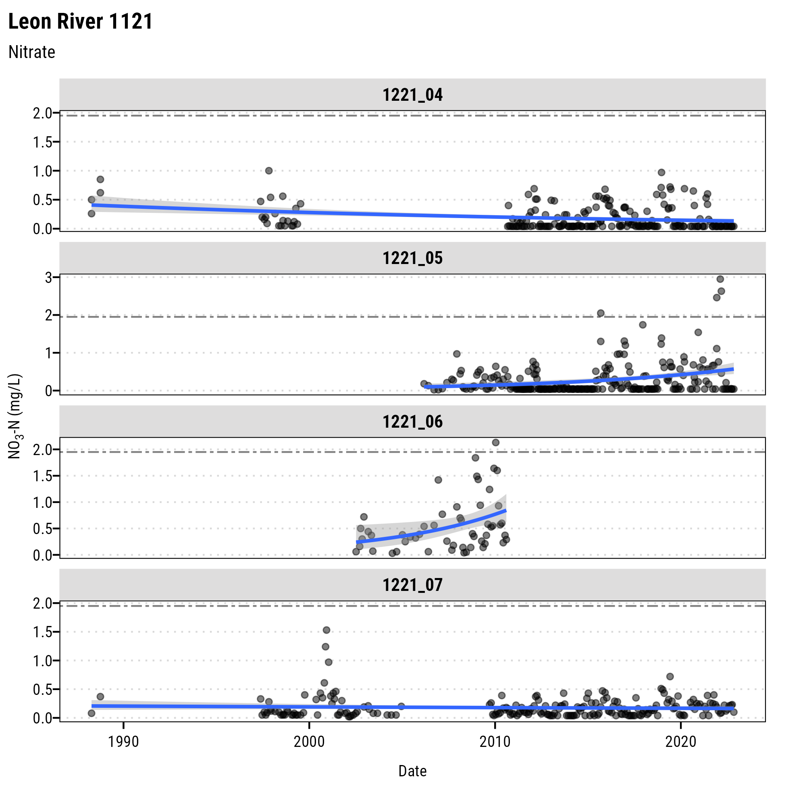

Example Simple Water Quality Scatter Plots
================

## Example repo for TWRI staff and students

This repository provide some example scripts for producing simple time
series scatter plots of water quality parameters using TCEQ’s SWQM data
by TCEQ assessment units.

The `script.R` file is a long script that uses ggplot and associated
functions to produce figures showing *E. coli*, DO, NO<sub>3</sub>, and
TP measurements over time with a trend line fit over the data. There is
a lot of redundant code in this script file which can be the source of
errors when generating plots.

The `functionalized_script.R` accomplishes the same task in many fewer
lines by using more of a functionalized workflow and the `purrr`
package. Importantly, this reduces errors and speeds up data processing,
but requires a slightly more advanced understanding of R. The
`functionalized_script.R` could further reduce lines by iterating
functions that read and format data before plotting.

Installation instructions for packages that are required for these
scripts:

``` r
install.packages(c("tidyverse","janitor", "ggtext", "ragg"))
install.packages("twriTemplates", repos = c(
 txwri = 'https://txwri.r-universe.dev',
 CRAN = 'https://cloud.r-project.org'))
```


